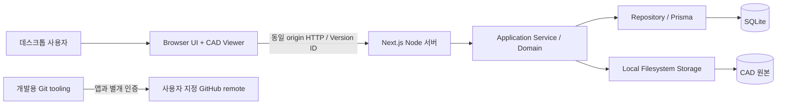
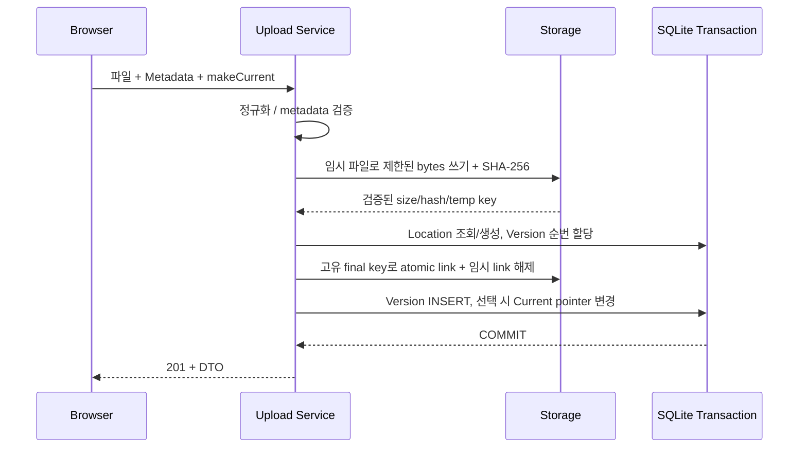
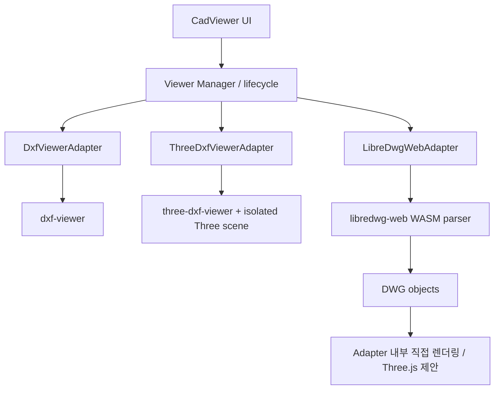
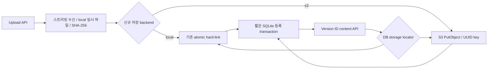

# Architecture 초안

상태: 실행 기반·DB·Upload 구현에 이어 목록·검색·Location 상세를 연결했다. Viewer는 승인된 후속 설계이다. 승인 기록은 [Decisions](Decisions.md), DB 정의는 [Database](Database.md), 테스트/Unit 의존성은 [TestPlan](TestPlan.md)을 기준으로 한다.

## GitHub #5 — 레이어 선택 UI

- 레이어 드롭다운은 Client Component로 두고 기존 `radix-ui` DropdownMenu의 CheckboxItem을 사용한다. 개별 선택 시 메뉴를 유지하며 전체 선택/해제와 선택 개수를 제공한다. UI의 controlled 선택 상태와 Manager.showLayer를 연결하고 브라우저 전용 Adapter 경계를 유지한다.
- 새 load 완료 시 Adapter.getLayers의 목록을 모두 선택 상태로 초기화한다. 재로드/Renderer/Version 전환·실패 시 이전 선택/메뉴를 제거한다. 보존 범위는 현재 로드된 Viewer의 메뉴 닫기/열기뿐이다. 도면 원본·Version 메타데이터에는 저장하지 않는다.
- Layer0 및 단순 명명 레이어는 합성 fixture로 검증한다. 복잡한 BLOCK/INSERT 상속과 upstream Layer 지원 범위 확장은 이번 UI 변경에 포함하지 않는다.

## GitHub #4 — 삭제 대화창 표시 구조

- 삭제 대화창은 기존 `radix-ui` Dialog의 Portal을 통해 body에 표시해 표의 `whitespace-nowrap`와 overflow 컨테이너에서 분리한다. panel에 normal wrapping·긴 문자열 분할·viewport 기준 최대 높이/내부 스크롤을 명시한다. UI 상태와 기존 DELETE 요청 흐름은 DeleteButton에 유지하고 DB/API를 변경하지 않는다.
- Dialog의 modal focus 관리와 Title/Description을 사용한다. 처리 중 닫기를 막고, 취소/닫기·정리 대기 확인 후 입력을 초기화한다. 검증 결과는 TestReport U-ISSUE4-20260911에 기록한다.

## System Context

### Unit DELETE — 0.17.0 도입 / 0.17.1 게시 전 보완

- 비밀번호 정책과 검증은 서버 전용 module로 둔다. Node 22의 비동기 scrypt, 랜덤 salt 16 bytes, key 32 bytes, N=32768/r=8/p=3 및 maxmem 64 MiB를 사용한다. 알고리즘/파라미터/salt/hash를 버전 있는 문자열로 저장하고 허용된 형식·파라미터와 canonical base64url만 검증한다. 길이가 같은 key를 timingSafeEqual로 비교하며 클라이언트 hash를 비밀번호 대체 토큰으로 받지 않는다. 등록과 삭제 모두 동시 KDF는 프로세스 전체 최대 2개, 대기열은 최대 16개이며 대기열 초과는429이다. hash 계산 중 DB 쓰기 transaction을 잡지 않는다. 근거: [Node 22 crypto](https://nodejs.org/docs/latest-v22.x/api/crypto.html#cryptoscryptpassword-salt-keylen-options-callback), [OWASP Password Storage](https://cheatsheetseries.owasp.org/cheatsheets/Password_Storage_Cheat_Sheet.html).
- 등록 multipart에 `deletePassword` 필드를 추가한다. 파일 수신/필드 수·크기 제한을 갱신하고 평문은 서버 hash 계산에만 사용한다. repository의 등록 메서드는 transaction 진입 전에 hash를 계산하고 기존 public DTO에는 포함하지 않는다. UI는 password input과 삭제용이라는 짧은 안내를 제공하며 성공/취소 시 입력을 비운다. 신규 등록 필수 입력 변경에 따라 기존 모든 fixture/API 호출도 갱신한다.
- `DELETE /api/cad-files/[versionId]`는 `application/json`의 `{password}`만 받고 실제 body를 최대 1 KiB로 제한한다. UUID·동일 origin을 검증하며 query/path/header에서 비밀번호를 받지 않는다. 비밀번호 불일치 403 `INVALID_DELETE_PASSWORD`, 입력 오류 400, 없는 Version 404, 시도 제한 429, DB 실패 500/503의 안전한 응답과 requestId를 반환한다. 비동기 검증 전에 Version별 시도를 예약하며60초 내 최대5회, 삭제 성공 시 해제한다. 429는 Retry-After로 남은 대기 시간을 안내한다. 카운터는 TTL·10,000개 상한의 단일 프로세스 메모리로 관리하며 상한에서 새 키를 거부하고 기존 제한을 지우지 않는다. 임의 forwarded IP를 신뢰하지 않는다.
- Service는 hash를 조회해 transaction 밖에서 비밀번호를 검증한 뒤, 짧은 쓰기 transaction에서 대상 존재/hash 불변을 재확인한다. 대상이 Current이면 pointer를 NULL로 변경하고, 삭제 원본 locator를 `CadDeletionJob`에 기록한 뒤 Version 행을 삭제한다. 다른 Version·Current는 보존한다. 실패 시 모두 rollback한다. DB가 삭제 승인/작업 상태의 유일한 기준이다.
- DB 삭제 commit이 확인된 다음에만 해당 job의 local/S3 원본을 삭제한다. 성공 또는 이미 없음은 job 제거 후 HTTP 200 `{deleted:true,cleanupPending:false}`이다. 스토리지 실패/불확실 완료는 job을 보존하고 HTTP 202 `{deleted:true,cleanupPending:true}`로 도면 삭제와 원본 정리 대기를 구분한다. commit 결과가 불확실하면 원본을 지우지 않고 결과 확인 안내를 반환한다. 원본 삭제 뒤 job 제거 실패도 pending으로 보존하며 반복 삭제는 안전하게 이미 없음을 처리한다.
- 정리 작업은 DB에 기록된 승인된 job만 처리하는 `storage:cleanup` 운영 명령으로 재실행한다. standalone CLI는 Next의 server-only context를 가져오지 않고 앱 환경으로 ConfiguredCadStorage를 만들며 종료 시 storage/DB를 닫는다. 미처리 작업 또는 실패가 있으면 nonzero로 종료한다. 임의 경로 입력/디스크 전체 scan/orphan 일괄 삭제는 하지 않는다. local locator 경로·symlink 보호를 유지하고 S3는 저장된 locator의 bucket/key를 사용한다. S3 versioning/외부 백업의 역사 버전 완전 소거는 지원하지 않는다.
- 목록과 Location에서 공유 삭제 dialog를 사용한다. 대상 파일/Version/위치와 Current 해제 영향, 비밀번호 입력 및 명시적 삭제를 제공한다. 성공/202에 관련 목록·Location·Viewer 캐시를 무효화하고 목록에서 제거한다. 네트워크 결과 불확실은 자동 재삭제하지 않고 목록 확인을 안내한다. 삭제된 직접 링크는 404/안전한 없음 화면이며 이미 브라우저에 받은 bytes까지 원격 회수할 수는 없다.
- 삭제 비밀번호는 삭제 권한만 부여한다. `1234`는 사용자 요청에 따른 기존 행 초기값으로 신규 기본값/관리자 우회가 아니다. hash 또는 password를 current/search/content route에 보내지 않는다. 요청 body·Prisma args를 진단 로그로 직렬화하지 않는다.



단일 Node 서버와 영속 로컬 디스크를 사용한다. SQLite와 파일 저장 때문에 stateless/serverless/Edge 배포를 기본으로 삼지 않는다. Browser는 DB나 디스크에 직접 접근하지 않는다. 원본 CAD를 외부 SaaS로 전송하지 않는다.

## Component 책임과 의존성

Version 직접 링크는 `viewers/core/link.ts`가 현재 HTTP(S) origin, encoded Version ID, 허용 renderer만 조합해 만든다. 목록·Location은 형식 기본 renderer를 사용하고 Viewer는 현재 renderer를 보존한다. URL에는 기존 query/hash, filesystem/S3 locator, 원본 경로, credential/public token을 복사하지 않는다.

| 영역 | 책임 | 경계 |
| --- | --- | --- |
| app / components | 라우팅, 공통 업무용 UI, 오류/로딩/빈 상태 | DB 및 파일 I/O 금지 |
| features/cad-upload | 파일 선택, Metadata 입력, 결과 표시 | 서버 검증을 대체하지 않음 |
| features/cad-list, cad-location | 검색, 페이지, 위치/버전 상세, Current 표시/변경 | Current는 서버 응답에서 파생 |
| Server Route Handlers | 입력 validation, HTTP status, Service 호출 | Node runtime, response DTO에서 저장 경로 제외 |
| server/services | 등록·파일/DB 보상 처리·Current transaction·조회 | Repository와 Storage 조정 |
| domain | 정규화, Version/Current 규칙, 도메인 오류 | React/Next/WebGL에 무관 |
| server/repositories | Prisma query/transaction, parameterized filtering | SQL/ORM 의존을 내부에 제한 |
| server/storage | 안전한 저장 키, streaming/크기 제한, hash, content 제공 | 원본 파일명을 실제 경로로 사용하지 않음 |
| features/cad-viewer | Metadata sidebar, Viewer 선택, Toolbar, metrics/status | 외부 라이브러리 API를 직접 호출하지 않음 |
| viewers/core | Manager, Adapter 계약, capability, metric 이벤트 | 업무 DB에 무관 |
| viewers/* | 각 라이브러리 API, 렌더링 자원 및 생명주기 | Adapter 간 CAD 객체/Three 인스턴스 공유 금지 |
| lib / config | 앱 설정 allowlist, 안전한 error/log 공통 처리 | Git 인증 변수를 앱에 전달하지 않음 |

의존 방향은 UI→Service→Domain/Repository, Viewer UI→Manager→Adapter→외부 라이브러리이다. Server 코드에는 server-only 경계를 적용하고 Viewer는 Client Component 내부에서 dynamic import한다. Top-level import나 SSR 경로에서 DOM/WebGL/WASM을 초기화하지 않는다.

## 소스 배치 계획

```text
src/                         # Next.js project root (src/src 중첩 없음)
  package.json, package-lock.json
  next.config.*, tsconfig.json, eslint.config.*
  app/
  components/ui/
  features/{cad-location,cad-upload,cad-list,cad-viewer}/
  domain/
  viewers/{core,dxf-viewer,three-dxf-viewer,libredwg-web}/
  server/{services,repositories,storage}/
  lib/
  scripts/                   # app-only env launcher, asset preparation
  prisma/                    # schema, migrations, ORM config as applicable
  public/                    # reviewed static assets; CAD originals 금지
  tests/{unit,integration,component,e2e}/
data/                        # runtime only, Git 제외
  db/
  cad/<location-id>/<version-id>/original.<dxf|dwg>
out/                         # 문서만, framework export output 아님
```

## 화면과 API 초안

공통 정보는 네 위치 값, Version, 파일명/형식, 등록일, Current이다. Viewer는 metadata sidebar + 넓은 canvas + renderer selector + 도구/metrics 상태 영역으로 구성한다. DWG 화면은 `libredwg-web`만 표시한다. 키보드로 입력/버튼 접근 가능하게 하고 에러·로딩·Current는 색상 외 문구도 사용한다.

| 화면 | 목적 |
| --- | --- |
| `/` | 모든 Version 목록, 검색/Filter, 페이지 이동 |
| `/cad/upload` | 파일 선택 및 Metadata, Current 체크, 등록 |
| `/cad/locations/[locationId]` | Location 상세·전체 Version·Current 지정 |
| `/cad/versions/[versionId]/viewer` | 선택한 정확한 Version 렌더링 |

`/cad/[locationId]`와 `/cad/[versionId]`의 동적 segment 충돌/ID 의미 혼동을 피하도록 명시적 경로를 사용한다.

| API | 요청·성공 결과 | 오류/검증 |
| --- | --- | --- |
| `POST /api/cad-files` | multipart: file, businessUnit, site, building, floor, registeredAt, makeCurrent → 201 Location/Version DTO 및 duplicate 정보 | 400 metadata/빈 파일/누락, 413 초과, 415 형식, 500 저장 실패 |
| `GET /api/cad-files` | filename, businessUnit, site, building, floor, format, current, page, pageSize → 200 items/total/page | 잘못된 query 400 |
| `GET /api/cad-locations/[locationId]` | Location 및 Version 목록 → 200 | 404 없음 |
| `PUT /api/cad-locations/[locationId]/current` | JSON versionId → 200 새 Current, 같은 요청은 멱등 | 400 ID 오류, 404 없음, 409 소속 불일치 |
| `GET /api/cad-files/[versionId]` | Version Metadata DTO → 200 | 404 없음 |
| `GET /api/cad-files/[versionId]/content` | 원본 bytes, 길이/안전한 content headers → 200 | 404 DB/파일 없음, 400 잘못된 ID |

사업부/사업장/동/층·format·current는 정확 일치, filename은 문자 그대로 부분 검색, 조합은 AND. `%`, `_`는 검색 wildcard로 해석하지 않는다. 기본 정렬 등록일 내림차순→생성시각 내림차순→ID 순으로 결정성을 보장한다. page 기본 1, pageSize 기본 25/최대 100을 제안한다. 검색 시 Current는 pointer 기준으로 계산하며 업데이트 후 목록/상세 캐시를 무효화한다. 일반 SQL LIKE의 언어별 대소문자 동작은 TC-LIST-002로 기록한다.

## 등록 Sequence와 실패 정합성



HTTP 본문은 제한을 적용하며 읽는다. Content-Length만 신뢰하거나 전체 파일을 무제한 formData buffer에 올린 뒤 크기를 확인하는 구조는 피한다. CAD parsing은 Browser Viewer에서 수행하므로 등록 성공과 렌더링 성공을 구분한다. 서버의 확장자·size 검증은 CAD 문법 충실도를 보증하지 않는다.

DB와 filesystem은 하나의 ACID transaction이 아니다. 큰 파일 쓰기/hash는 DB transaction 밖에서 하고 짧은 transaction 안에서는 동일 filesystem의 exclusive hard-link publication과 DB write만 수행한다. 기존 파일이 있으면 EEXIST로 실패하여 overwrite를 방지한다. publication 실패는 DB rollback, DB 실패는 새 파일 정리, process crash로 남은 파일은 운영 복구 대상으로 기록한다. 응답 전 commit이 실패하면 Current를 바꾸지 않는다. commit 여부가 불확실하면 재조회 없이 파일을 삭제하지 않는다. 성공 DB 행을 가리키는 파일은 정리하지 않는다. orphan 정리는 [Operation](Operation.md)의 확인 절차를 따른다.

동시 등록/Current 경쟁은 DB 제약+짧은 쓰기 transaction과 단일 프로세스 queue로 직렬화하고 실패 시 명확한 오류로 처리한다. commit 불확실 작업은 자동 재실행하지 않는다.

## Viewer Manager와 계약 초안



계약은 mount(container), load(ArrayBuffer, cancellation context), fitToView, zoomIn, zoomOut, resize, dispose 및 capabilities/metrics/error callback을 제공하는 방향이다. Pan은 canvas controls가 담당한다. 기능별 `supported / partial / unsupported / unverified`와 사유를 노출한다. 실제 API 확인 후 계약을 확정하며 외부 API 이름을 추측해 구현하지 않는다.

- DXF: content API→ArrayBuffer→선택 Adapter. 라이브러리가 URL/File만 받으면 Adapter 내부 임시 Blob URL/File로 감싸고 종료 시 해제한다.
- DWG: content API→ArrayBuffer→WASM 초기화→직접 parse→DWG 객체→Adapter 내부 drawing primitives→화면. DXF 문자열·파일을 생성하거나 DXF Viewer로 전달하지 않는다. 승인된 Unit 7A 최소 실험에서 검증하고 Unit 7B에서 등록 도면에 연결한다.
- 상태: idle→loading→ready/partial/error→disposed. 미지원 Entity는 warning과 개수/형식으로 표시하며 빈 canvas를 SUCCESS로 처리하지 않는다.
- 전환은 load generation/취소 토큰으로 이전 비동기 결과를 무시한다. unmount/실패 시에도 listener, observer, RAF, GPU geometry/material/texture, controls, Blob URL, Worker/WASM 할당을 정리한다. Strict Mode의 반복 mount와 이중 dispose를 검증한다.
- Worker는 라이브러리 호환성 실험 후 도입한다. DWG는 취소/반복 load 격리를 위해 전용 Worker 우선 검토; worker 종료만으로 모든 GPU/메인스레드 자원이 해제된다고 가정하지 않는다.
- 한글용 재배포 가능한 font와 WASM/worker 파일은 같은 origin에서 제공한다. 적용 라이선스/폰트 경로/해시와 결손 glyph를 기록한다. CAD의 원래 글꼴과 동일하다고 가정하지 않는다.

## 라이브러리 근거와 검증 상태

2026-09-07 공식 README/저장소 파일 조사. 아래 정보는 설치/실행 결과가 아니며 Unit 0B/7A에서 npm 배포본, lock 및 실제 Type/API를 대조한다. 검증된 exact version만 package에 고정하고 변경 시 해당 Viewer를 재시험한다.

| 기술 | 공식 근거로 확인한 역할 | 초기 확인/검증 과제 |
| --- | --- | --- |
| dxf-viewer | Three.js 기반 DXF WebGL Viewer, worker 지원 구조, Layer 숨김/표시 | 조회 package 1.0.48, MPL-2.0; 문서에 text styling/MTEXT/linetype/encoding 등의 미완성 항목 존재. 실제 Sample로 재확인 |
| three-dxf-viewer | DXF를 Three 객체로 생성; Layer/Select/Hover/Snap 유틸리티를 문서화 | 조회 package 1.0.44, MIT; Scene/camera/control와 자원 수명은 Adapter에서 관리, 실제 package/peer 조합 고정 필요 |
| @mlightcad/libredwg-web | LibreDWG WASM JavaScript parser, raw/wrapper API | 조회 package 0.7.10, GPL-3.0; 완성형 viewport 아님. parse→direct render, allocation/free API, WASM asset 검증 필요 |

출처: [dxf-viewer README](https://github.com/vagran/dxf-viewer), [package](https://github.com/vagran/dxf-viewer/blob/master/package.json), [three-dxf-viewer README](https://github.com/ieskudero/three-dxf-viewer), [package](https://raw.githubusercontent.com/ieskudero/three-dxf-viewer/master/package.json), [LibreDWG JS README](https://github.com/mlightcad/libredwg-web/blob/master/bindings/javascript/README.md), [package](https://github.com/mlightcad/libredwg-web/blob/master/bindings/javascript/package.json).

LibreDWG README의 예제와 배포본이 다를 수 있으므로 `dwg_free` 대상/함수 signature를 실제 타입·소스와 대조한다. 조회 build 설정은 큰 WASM 초기 메모리를 지정하지만 실제 Browser 사용량은 측정 전 미확정이다. 라이선스 표시는 조사 사실이며 제품 배포 정책 결론은 내리지 않는다. 새 외부 Viewer 제품을 임의 도입하지 않는다.

## 오류 처리와 관측

서버 오류는 `{error:{code,message,requestId}}` 형태로 제한하고 원본 경로·SQL·stack·Secret을 UI에 노출하지 않는다. 상세 개발 로그는 requestId로 연결하되 env/인증 헤더/파일 bytes를 기록하지 않는다. 파서가 raw CAD 내용을 console에 출력하는지도 검사한다.

Viewer는 FETCH_FAILED, FILE_NOT_FOUND, PARSE_FAILED, VIEWER_INIT_FAILED, WASM_LOAD_FAILED, DWG_PROCESS_FAILED, UNSUPPORTED_ENTITY 등을 사용자 문구에 매핑한다. 일부 Entity 미지원은 partial로, 전체 불능은 error로 구분한다. 오류 후 재시도/목록 이동 경로를 제공한다.

측정 정의와 비교 양식은 TestPlan/TestReport를 기준으로 한다. Performance API와 필요한 최소 계측만 사용하고 별도 모니터링 플랫폼을 추가하지 않는다.

## Unit OBS — 업로드 요청 진단 설계 (0.16.0)

- Route Handler가 origin 검증·context 초기화 전에 서버 UUID/시작 시각을 만들고 업로드 범위에 전달한다. 명시 인자 또는 서버 전용 AsyncLocalStorage로 동시 요청을 격리한다. 사용자 입력 ID를 무검증 로그 식별자로 신뢰하지 않는다. 성공/실패 응답의 `X-Request-Id`와 기존 `{error:{code,message,requestId}}`를 연결한다.
- 서버 전용 모듈은 한 줄 JSON 이벤트를 stdout/stderr에 기록한다. 공통 필드는 event, timestamp, appVersion, requestId, stage, elapsedMs, outcome이고 해당 시 backend/status/error를 추가한다. 수신·검증·저장·DB 등록·정리·응답은 실제 계층 경계에서 기록하며 최초 실패 단계와 보상/정리 단계를 구분한다.
- 오류는 허용 필드인 name/code, 정제된 message/stack, 제한된 cause chain 및 필요한 S3 HTTP 상태 등으로 표현한다. env/요청·응답/SDK 객체/Prisma query·parameters·meta/입력 메타데이터·파일명·원본 locator를 직렬화하지 않는다. credential·URL·경로·SQL·사용자 입력이 포함될 수 있는 메시지는 마스킹 또는 억제한다. 순환 cause·개행 로그 주입·장문을 제한하고 안전하게 제거하기 어려운 문자열은 코드/범주로 대체한다.
- S3 wrapper의 공개 CadError는 원래 예외를 서버 전용 cause로 보존한다. 불확실 PUT의 object UUID 및 cleanup pending 등 기존 복구 단서는 같은 ID로 연결한다. PUT/COMMIT 불확실 원본 보존, DB 부재 확인 후 보상 삭제 정책은 유지한다.
- 수신/등록 오류 후 정리 실패는 최초 원인을 덮지 않고 별도 경고로 남긴다. DB 등록 확정 뒤 임시 파일 정리만 실패하면 성공을 유지하고 경고를 남긴다. 진단 자체가 업무 결과를 바꾸지 않아야 한다.
- 클라이언트는 HTTP 상태·응답 형태를 함께 판별한다. 공개 문구는 허용 코드 매핑을 사용하고 raw HTML/임의 JSON/브라우저 예외 메시지를 화면·저장·Console에 포함하지 않는다. 정상 등록 구조가 아닌 2xx도 결과 불확실로 안내한다. 공개 진단은 시각/버전/상태/코드/서버 ID/고정 안내만 포함한다.
- 펼침 상세는 줄바꿈/스크롤, 읽기 전용 텍스트 선택, 복사, 로컬 Blob JSON 저장을 제공한다. Blob URL은 해제한다. HTTP/Clipboard 미지원·거부 시 직접 선택/저장 안내를 유지한다. Console에는 동일한 공개 진단만 보조 출력한다.
- Docker Compose app에 `local` 로그 드라이버와 max-size 10m, max-file 5 순환 보관을 명시한다. 로그는 컨테이너 수명에 연결되므로 교체 전 수집 절차를 Operation에 둔다. 신규 DB table/외부 전송은 없다.

## 향후 확장 경계

Storage 인터페이스 뒤 object storage, Repository 뒤 DBMS, Viewer Adapter 추가, 권한/감사, 실도면 기반 성능 최적화를 확장할 수 있다. 현재 구현에는 포함하지 않는다. 실제 모델 변경·배포 환경 변경·라이브러리 대체가 필요하면 근거와 영향을 먼저 기록한다.

## 2026-09-07 실행 순서 변경

사용자가 계획 실행을 승인했다. DXF 두 Viewer와 공통 관리 기능·계측·회귀를 먼저 구현하고, libredwg-web은 그 다음 MINOR 버전으로 진행한다. DWG 선행 실험은 DXF 구현의 조건에서 제외한다. 최신 단계/승인 상태는 Decisions의 ADR-011과 TestPlan을 따른다. 기존 미실행 기록은 당시 상태이며 실제 완료 후 갱신한다.

실제 기반 버전: Next 16.3.4, React 19.2.8, TypeScript 5.9.3, Prisma/client/SQLite adapter 7.10.0, Tailwind 4.3.3, Vitest 5.0.0, Playwright 1.63.0. src/package.json과 lock이 설치 기준이다. Prisma 8 RC는 선택하지 않았다.

## Unit 3 — 목록 및 버전 상세 구현

`app/page.tsx` → `CadListService` → `CadListRepository` → SQLite JOIN으로 등록된 모든 버전을 조회한다. `/cad/locations/{locationId}`에서 위치별 버전과 Current 변경을 제공한다. 기존 등록/content/current API는 유지한다.

- `GET /api/cad-files`: filename, businessUnit, site, building, floor, format(DXF/DWG), current(true/false), page, pageSize. 응답은 items/total/page/pageSize이다. 기본 25개, 최대 100개; page는 1부터이다. 중복/잘못된 조건은 400이다.
- `GET /api/cad-locations/{locationId}`: 안전한 위치 메타데이터와 versions. 잘못된 ID는 400, 없는 Location은 404이다.
- 파일명은 SQLite `instr`로 대소문자 구분 부분 일치; `%`, `_`, 인용부호는 문자 그대로 처리한다. 위치는 trim/NFC 후 정확히 비교하며 조건은 AND이다. SQL 값은 parameter binding을 사용한다.
- 등록일 DESC, 생성일 DESC, ID ASC의 결정적 정렬. count/rows는 기존 트랜잭션 큐를 공유하여 하나의 조회 snapshot을 사용한다. 조회 DTO에는 storage path/hash가 없다.
- 목록/상세는 force-dynamic, JSON 조회는 no-store. 등록·Current 변경은 revalidatePath, 클라이언트 성공 후 router.refresh로 이전 목록을 갱신한다.
- 빈 결과·잘못된 조건·로딩·일반 서버 오류를 구분한다. 없는 Viewer 링크를 제공하지 않는다. DB Schema/migration 변경 없음.

## Unit 4 — dxf-viewer 구현

- 실제 설치: dxf-viewer 1.0.48(MPL-2.0), Three.js 전이 의존 버전은 package-lock 기준. upstream source는 수정하지 않았다. [공식 소스](https://github.com/vagran/dxf-viewer/tree/master/src)의 실제 설치본 API와 대조했다.
- 경로: `/cad/versions/{versionId}/viewer`. Server page는 Service/Repository의 안전한 메타데이터를 사용한다. DXF만 도면 보기 링크를 제공하고 DWG 직접 접근은 후속 구현 안내이다.
- Client effect → ViewerManager → 동적 import DxfViewerAdapter → DxfViewer. 원본 ID content API → ArrayBuffer → 임시 Blob URL → Web Worker의 SetupWorker/Load → WebGL. Worker는 webpack 자산이며 CDN을 사용하지 않는다.
- 실제 API: Load, FitView/GetBounds/GetOrigin, SetView/GetCamera, Render, Destroy. Zoom은 현재 camera zoom을 반영한 view width 변경, Pan은 내장 OrbitControls, Resize는 autoResize이다.
- Manager는 fetch AbortController와 세대 번호로 이전 초기화/Load 결과를 취소한다. Adapter는 Worker 처리 120초 timeout, Blob URL 해제, Destroy 및 context loss/canvas 제거를 수행한다. Layer/hover/select/snap은 이번 UI에 미제공이다.
- 사용자 상태: 로딩/표시/빈 도면/실패/재시도. WebGL 생성 실패와 원본 조회 실패를 안내하며 파서 예외는 일반화한다. parse timing·Entity count·memory 수치는 아직 측정하지 않는다.
- 글꼴을 번들하지 않아 TEXT/한글 누락 가능성을 항상 안내한다. 공식 문서의 기능 설명과 실제 LINE/CIRCLE 검증을 구분한다. DB Schema 변경 없음.

## Unit 5 — 두 번째 Adapter 및 글꼴

- `three-dxf-viewer` 1.0.44(MIT)는 getFromPath(url, fontJsonUrl)로 Group을 반환한다. 설치된 dist/main.js와 README를 확인했다. 패키지 자체에 Three 0.171 코드가 포함되어 있고 앱 Scene/Camera/OrbitControls도 직접 의존 Three 0.171.0으로 고정한다. dxf-viewer의 Three 0.161 전이 의존은 별도로 유지한다.
- Browser 동적 import 후 별도 Scene, OrthographicCamera, WebGLRenderer, OrbitControls와 ResizeObserver를 생성한다. 외부 라이브러리 소스 수정 없음. getFromFile은 내부 Blob URL 해제를 제공하지 않아 Wrapper 소유 Blob URL을 getFromPath로 전달한다.
- Adapter는 ASCII DXF SECTION/EOF 구조를 사전 확인하고 library의 null/실패를 오류로 처리한다. 빈 도면은 bounds 기준이다. 검정 배경 대비를 위해 순수 검정 material을 흰색으로 보정하되 전역 캐시 재료를 변경하지 않도록 clone한다.
- 생성 geometry/material/texture, controls/observer/canvas/context를 해제하며 늦게 도착한 Group도 해제한다. upstream 전역 material cache는 public clear API가 없어 잔여 위험으로 남는다. three 파싱은 메인 스레드여서 120초 timeout이 동기 parse를 선점하지 못한다.
- `?renderer=dxf-viewer|three-dxf-viewer`로 각각 접근한다. Unit 5의 비교 링크는 전체 페이지 탐색이며 Unit 6의 seamless switching/byte 재사용과 구분한다. DWG는 DXF Adapter로 전달하지 않는다.
- optional Adapter getLayers/showLayer는 실제 object의 entity.layer 메타데이터에 기반한다. 복잡한 INSERT 상속/중첩 Layer는 아직 검증하지 않았다.
- 설치본은 생략된 Z를 가진 일부 2D Entity에서 NaN geometry를 생성했다. Wrapper가 LINE/CIRCLE/ARC/TEXT/MTEXT/INSERT/POINT의 생략된 Z를 0으로 채운 임시 표현을 전달한다. 저장 원본/다운로드 bytes는 유지한다. 유한하지 않은 bounds는 성공으로 표시하지 않는다.
- 같은 한글 TTF를 dxf-viewer는 직접, three-dxf-viewer는 Three TTFLoader로 변환한 JSON으로 사용한다. build/dev 전 변환, 생성물 Git 제외. font 소스/라이선스는 Operation이 기준이다. DB 변경 없음.

## Unit 6 — 같은 화면의 DXF 전환

- Client renderer 버튼/state와 native history.replaceState로 선택 URL을 갱신한다. Server page의 CadViewer key는 renderer가 아닌 Version ID여서 같은 도면의 화면/메타데이터가 유지된다. Unit 5의 전체 페이지 링크를 대체한다.
- ViewerSource는 mounted Version 수명 동안 원본 Promise/ArrayBuffer 하나를 유지한다. 여러 로딩 요청은 같은 다운로드를 기다리고 각 Manager는 bytes.slice(0)로 Adapter 전용 복사본을 받는다. Adapter의 좌표 보완/변경이 다음 Renderer 원본에 영향을 주지 않는다.
- Renderer 변경은 이전 Manager/Adapter만 dispose하고 공유 다운로드는 유지한다. Version 변경/페이지 이탈은 Source를 abort/해제한다. 다시 불러오기는 cache를 비워 새 다운로드를 수행한다. 실패 Promise는 cache에서 제거하여 재시도가 가능하다.
- 선택 변경 즉시 조작 버튼과 Layer 상태를 초기화한다. effect 활성 플래그/Manager generation으로 늦은 factory/Load 결과를 버린다. Renderer별 카메라 위치/Layer 선택은 전환 시 초기화한다.
- 자원 검증은 테스트 전용 Worker/Blob/context 계수로 수행한다. 일반 앱에 진단 전역이나 모니터링 프레임워크를 추가하지 않는다. 도면 크기만큼 원본과 Adapter 복사본 메모리 비용이 있으며 전체 heap/GPU 누수는 별도 평가이다.

## Unit 8A — 관측 가능한 단계의 계측

- Manager는 performance.now로 sourceWaitMs(공유 source 대기), initializeMs(dynamic import/constructor), adapterLoadMs(bytes 복사+Adapter Load), totalMs를 기록한다. firstDisplayMs는 non-empty Load 성공 후 visible document의 다음 animation frame callback을 관찰한 시점이다. GPU presentation 완료가 아니다. hidden/timeout은 null+사유이다.
- 결과는 success/empty/error/cancelled. success는 Load/bounds가 성공한 상태이며 Entity fidelity/누락 여부를 판정하지 않는다. 파서와 prepare의 독립 hook을 쓰지 않으므로 parseMs는 항상 null과 사유를 보관한다.
- sourceMode는 miss/pending/memory. fileBytes는 실제 확보 bytes, three entityCount는 lastDXF.entities 길이(원본 Entity 수); dxf는 메모리 보존 비용을 늘리지 않고 null+사유이다.
- JS heap은 performance.memory.usedJSHeapSize가 있을 때의 비표준 snapshot, 없으면 null이다. GPU/WASM과 전체 process memory를 포함한다고 해석하지 않는다. browser는 userAgent이며 파일 경로/원본 데이터/Secret은 metric에 없다.
- UI는 현재 선택의 최종 기록만 표시/JSON export한다. 이전 선택 취소 기록은 Manager callback으로 제공하지만 stale UI는 덮어쓰지 않는다. JSON schemaVersion=1. Runtime DB에 저장하지 않는다.
- benchmark는 독립 임시 DB, 최대 upload 20 MiB, 1 worker, 생성 도면을 사용한다. 원본 hash/bytes/Entity 수 및 매 회 개별값을 JSONL로 남기며 자동 요약에 포함한다. 이 harness는 일반 E2E와 별도 명령이다.

## Unit 7A — 독립 DWG 기술 실험 (0.9.0)

- `/lab/dwg`에서 local File ArrayBuffer→전용 module Worker→libredwg-web 0.7.10 WASM→DwgDatabase의 model-space LINE→직접 Three.js LineSegments를 표시한다. 업로드/DB 관리 경로와 독립이며 운영 도면 Viewer 연결은 7B이다. DXF 문자열 생성이나 DXF Viewer 호출이 없다.
- 패키지의 역할은 파싱이다. `linePrimitives`와 `line-view`는 앱의 최소 렌더러이며 평면·유한 좌표·표시 가능한 LINE만 처리한다. CIRCLE 및 다른 Entity, 비평면/숨김/PaperSpace LINE은 제외 건수를 기록한다. 색/선종류/두께/레이어 규칙·BLOCK 확장은 아직 구현하지 않았다.
- 실제 0.7.10 raw API: createModule→FS.writeFile→dwg_read_file→LibreDwg.createByWasmInstance(raw).convert(pointer). finally에서 FS.unlink와 raw.dwg_free(pointer), Worker 결과 전달 후 terminate. 포인터와 변환 JS 객체를 혼동하지 않는다. 파서 nonzero error flags는 최소 실험에서 모두 오류로 처리한다.
- 초기 npm ESM import 빌드는 guarded `node:module` 의존성을 Webpack이 해석하여 UnhandledSchemeError가 발생했다. upstream 수정 없이 `scripts/wasm.mjs`가 dist ESM/wasm glue/wasm 및 package/README를 `public/libredwg`에 복사한다. Worker는 webpackIgnore dynamic import로 브라우저 native ESM을 사용한다. 공개 자산은 설치된 고정 배포본 그대로이며 build/dev에 생성하고 Git 제외한다.
- Worker는 요청마다 생성/종료, 60초 timeout 및 교체/unmount 취소를 제공한다. 외부 DWG는 20 MiB 이하의 실험 입력만 허용한다. Worker 종료는 WASM 인스턴스 수명 격리이며 즉시 OS 메모리 반환의 보장은 아니다. 패키지 빌드 옵션 INITIAL_MEMORY=1GB이므로 저메모리 장비 적용성은 별도 검증이 필요하다.
- 공식 근거: [배포본 upstream](https://github.com/mlightcad/libredwg-web), [JS README](https://github.com/mlightcad/libredwg-web/blob/5909bd2bb87fa1168838e1295188f3ee603618eb/bindings/javascript/README.md). 실제 구현 기준은 설치된 0.7.10의 lib/libredwg.js, wasm/libredwg-web.d.ts 및 package.json. 라이선스 표기는 GPL-3.0이다.

## Unit 7B — 등록 DWG Viewer 통합 (0.10.0)

- 목록/Location의 도면 보기→Version 메타데이터 조회→selectRenderer(DWG)=libredwg-web→CadViewer→DWG 전용 Manager→LibreDwgWebAdapter→원본 ID API→Worker→자체 LINE renderer. 서버에서 DB 형식을 DXF/DWG로 검증하며 query의 DXF 선택값을 DWG에 적용하지 않는다. 두 DXF 버튼은 DWG 화면에서 제공하지 않는다.
- Manager는 생성 시 허용 형식을 지정한다(기존 기본값 DXF). 서로 다른 형식 load는 다운로드/Adapter 생성 전에 거부한다. Adapter는 20 MiB 한도·DWG 헤더 확인 후 기존 Worker를 사용한다. 지원하지 않는 revision/손상 본문은 raw parser nonzero flag를 안전한 파싱 오류로 처리한다. 새로운 DWG revision을 검증했다고 주장하지 않는다.
- load 결과에 선택적 warning을 추가했다. 표시 제외 Entity가 있으면 UI에 건수를 표시하고 공통 계측 result='partial', reasons.coverage를 기록한다. 표시할 LINE이 0개여도 제외 Entity가 있으면 empty 성공으로 축소하지 않는다. schemaVersion 1에 partial enum을 추가했으므로 JSON 소비자는 새 결과값을 허용해야 한다. 상세 DWG init/parse/convert 지표 통합은 8B이며 현재 공통 parseMs는 null이다.
- 직접 renderer에 OrthographicCamera/OrbitControls 기반 확대·축소·Pan·Fit 및 Resize 대응을 연결한다. LINE 기하 범위는 7A 그대로이며 스타일/곡선/텍스트/BLOCK은 미구현이다. LINE 이외 파서 지원과 자체 renderer 범위를 구분한다.
- 재시도는 공유 원본 cache를 비우고 이전 Manager/Adapter를 dispose한다. 화면 이탈/교체 시 Worker cancel(AbortError)/terminate, controls/ResizeObserver/geometry/material/WebGL context/canvas를 해제한다. 종료 후 queued Resize/render callback을 차단한다. Adapter가 늦게 완료해도 generation/active 검증으로 이전 결과를 반영하지 않는다.
- Next Client Component 내 dynamic import로 외부 Viewer를 초기화하고 DWG Worker는 7A의 local ESM/WASM 경계를 유지한다. DB/Storage/API contract 및 migration은 변경하지 않았다.

## Unit S3 — 선택 가능한 S3 호환 저장소 (0.11.0)

2026-09-08 사용자가 SeaweedFS와 같은 S3 호환 object storage를 명시적으로 요청했다. 기존 Local Filesystem 요구는 기본 backend로 유지하고 선택적 S3 backend를 추가한다. DB는 SQLite/local disk 그대로이다.



- StorageBackend는 receive/publish/content/removeUncommitted 및 optional prepare 계약이다. ConfiguredCadStorage는 기존 CadStorage의 수신/로컬 경로 보호를 재사용하고 locator로 조회/정리 backend를 결정한다. context는 storage/client를 프로세스에서 재사용한다.
- S3 prepare는 DB transaction **전**에 파일을 PUT한다. 네트워크 지연 동안 SQLite writer transaction을 유지하지 않는다. 성공한 locator를 repo.register에 전달하며 기존 Version/Current transaction은 불변이다. local publish는 기존 transaction 내 exclusive hard-link 방식 그대로이다.
- DB 저장 위치의 단일 정의는 Database.md. 기존 local 상대 경로와 `s3:<bucket>:cad/<object-uuid>/original.<format>`을 구분한다. backend 설정은 새 업로드에만 적용한다. 조회는 저장된 locator를 따르므로 local↔S3 설정 전환 후에도 혼합 조회할 수 있다. endpoint는 한 개의 서버 설정을 사용한다.
- S3ObjectStorage는 @aws-sdk/client-s3 **3.1127.0**(Apache-2.0)을 고정한다. endpoint/region/path-style/access key/secret/session token/timeout을 서버 환경변수로 설정한다. SDK 재시도는 1회(maxAttempts=1), PUT은 If-None-Match=*로 overwrite를 거부한다. 버킷 생성은 앱 기능이 아니다.
- Stream 수신→임시 디스크→PUT read stream, GET→SDK body WebStream→기존 ID API response이다. 전체 CAD를 server memory buffer로 올리지 않는다. ContentLength와 SHA-256 metadata를 전송하며 ETag를 SHA-256로 해석하지 않는다. SDK checksum 정책은 WHEN_REQUIRED로 설정해 S3 호환 구현의 불필요한 checksum 확장을 피한다. 실제 byte/hash 일치는 시험에서 검증한다.
- PUT 실패/응답 유실은 성공 DB 행을 만들지 않고 503을 반환한다. 서버가 저장했는지 불확실하므로 자동 삭제하지 않고 random object ID만 안전한 운영 로그에 남긴다. PUT 성공 후 DB 오류는 해당 locator가 DB에 **없음이 확인될 때만** 새 object를 삭제한다. DB 조회/삭제 실패 또는 COMMIT 불확실 시 보존하고 cleanup pending으로 기록한다.
- GET NoSuchKey는 404, 인증/연결/버킷 문제는 안전한 503이다. 임의 경로/locator는 pattern 검증으로 거부한다. client는 versionId만 전달하며 bucket/key/endpoint/credentials 또는 presigned URL을 받지 않는다. Browser CORS/S3 credentials가 필요하지 않다.
- [AWS S3Client](https://docs.aws.amazon.com/AWSJavaScriptSDK/v3/latest/client/s3/), [PutObject 조건부 요청](https://docs.aws.amazon.com/AmazonS3/latest/API/API_PutObject.html), [SDK checksum 정책](https://docs.aws.amazon.com/sdk-for-javascript/v3/developer-guide/s3-checksums.html), [SeaweedFS 공식 저장소](https://github.com/seaweedfs/seaweedfs). 실제 호환 검증은 SeaweedFS 4.45로 수행하며 다른 제품의 통과를 추정하지 않는다.

## Docker 배포 구조 — Unit DEPLOY

`src/Dockerfile`은 고정 Node 22.14.0 bookworm-slim 기반으로 의존성 설치→Prisma/font/WASM/Next build→runtime을 분리한다. Runtime은 UID10001의 비root 계정이며 `/data`와 Next cache에 필요한 쓰기 권한만 갖는다. Prisma migration CLI를 포함하므로 현재 image는 개발 dependency도 포함한다. image 크기 최적화보다 재현 가능한 native SQLite 실행을 우선했다.

Compose root context `..`의 `.dockerignore`는 root/중첩 Secret, host node_modules/build, CAD/DB를 제외한다. Root `.dockerignore`는 Docker context 필터 위치 제약에 따른 설정 예외이며 실행 소스·Dockerfile·Compose는 src에 유지한다. 앱만 기동하고 기존 SeaweedFS 등 외부 서비스를 생성하거나 변경하지 않는다. S3는 runtime app env로 연결한다.

단일 app container→named `/data` volume의 SQLite/CAD 구조이다. migration 성공 후 `0.0.0.0:3000`으로 실행하고 host publish port를 통해 localhost/LAN 접근을 허용한다. `/api/health`는 DB 조회 readiness이며 S3 원본 전체의 접근성을 보장하지 않는다. 이미지 저장소는 지정 GitHub 소유자의 GHCR이며 image tag/digest와 source commit은 배포 결과에 연결한다.
