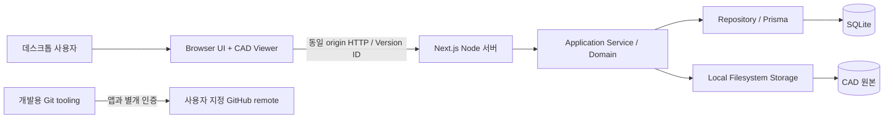
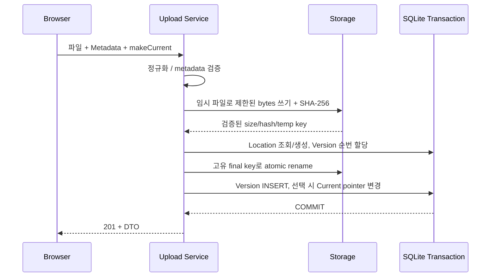
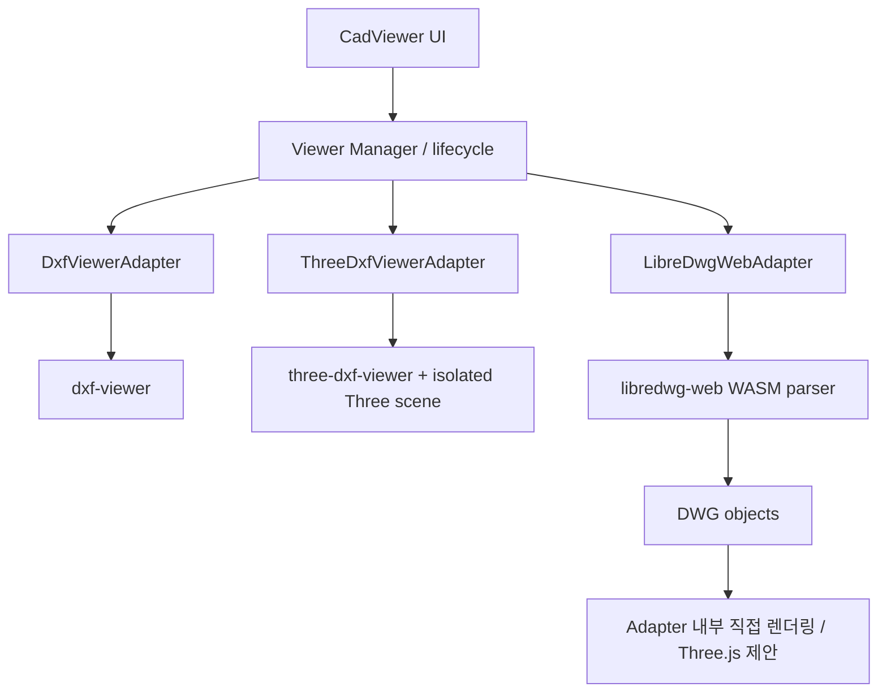

# Architecture 초안

상태: 구현 전 계획. 승인 기록은 [Decisions](Decisions.md), DB 정의는 [Database](Database.md), 테스트/Unit 의존성은 [TestPlan](TestPlan.md)을 기준으로 한다.

## System Context



단일 Node 서버와 영속 로컬 디스크를 사용한다. SQLite와 파일 저장 때문에 stateless/serverless/Edge 배포를 기본으로 삼지 않는다. Browser는 DB나 디스크에 직접 접근하지 않는다. 원본 CAD를 외부 SaaS로 전송하지 않는다.

## Component 책임과 의존성

| 영역 | 책임 | 경계 |
| --- | --- | --- |
| app / components | 라우팅, 공통 업무용 UI, 오류/로딩/빈 상태 | DB 및 파일 I/O 금지 |
| features/cad-upload | 파일 선택, Metadata 입력, 결과 표시 | 서버 검증을 대체하지 않음 |
| features/cad-list, cad-location | 검색, 페이지, 위치/버전 상세, Current 표시/변경 | Current는 서버 응답에서 파생 |
| Server Route Handlers | 입력 validation, HTTP status, Service 호출 | Node runtime, response DTO에서 저장 경로 제외 |
| server/services | 등록·파일/DB 보상 처리·Current transaction·조회 | Repository와 Storage 조정 |
| domain | 정규화, Version/Current 규칙, 도메인 오류 | React/Next/WebGL에 무관 |
| server/repositories | Prisma query/transaction, parameterized filtering | SQL/ORM 의존을 내부에 제한 |
| server/storage | 안전한 저장 키, streaming/크기 제한, hash, content 제공 | 원본 파일명을 실제 경로로 사용하지 않음 |
| features/cad-viewer | Metadata sidebar, Viewer 선택, Toolbar, metrics/status | 외부 라이브러리 API를 직접 호출하지 않음 |
| viewers/core | Manager, Adapter 계약, capability, metric 이벤트 | 업무 DB에 무관 |
| viewers/* | 각 라이브러리 API, 렌더링 자원 및 생명주기 | Adapter 간 CAD 객체/Three 인스턴스 공유 금지 |
| lib / config | 앱 설정 allowlist, 안전한 error/log 공통 처리 | Git 인증 변수를 앱에 전달하지 않음 |

의존 방향은 UI→Service→Domain/Repository, Viewer UI→Manager→Adapter→외부 라이브러리이다. Server 코드에는 server-only 경계를 적용하고 Viewer는 Client Component 내부에서 dynamic import한다. Top-level import나 SSR 경로에서 DOM/WebGL/WASM을 초기화하지 않는다.

## 소스 배치 계획

```text
src/                         # Next.js project root (src/src 중첩 없음)
  package.json, package-lock.json
  next.config.*, tsconfig.json, eslint.config.*
  app/
  components/ui/
  features/{cad-location,cad-upload,cad-list,cad-viewer}/
  domain/
  viewers/{core,dxf-viewer,three-dxf-viewer,libredwg-web}/
  server/{services,repositories,storage}/
  lib/
  scripts/                   # app-only env launcher, asset preparation
  prisma/                    # schema, migrations, ORM config as applicable
  public/                    # reviewed static assets; CAD originals 금지
  tests/{unit,integration,component,e2e}/
data/                        # runtime only, Git 제외
  db/
  cad/<location-id>/<version-id>/original.<dxf|dwg>
out/                         # 문서만, framework export output 아님
```

## 화면과 API 초안

공통 정보는 네 위치 값, Version, 파일명/형식, 등록일, Current이다. Viewer는 metadata sidebar + 넓은 canvas + renderer selector + 도구/metrics 상태 영역으로 구성한다. DWG 화면은 `libredwg-web`만 표시한다. 키보드로 입력/버튼 접근 가능하게 하고 에러·로딩·Current는 색상 외 문구도 사용한다.

| 화면 | 목적 |
| --- | --- |
| `/` | 모든 Version 목록, 검색/Filter, 페이지 이동 |
| `/cad/upload` | 파일 선택 및 Metadata, Current 체크, 등록 |
| `/cad/locations/[locationId]` | Location 상세·전체 Version·Current 지정 |
| `/cad/versions/[versionId]/viewer` | 선택한 정확한 Version 렌더링 |

`/cad/[locationId]`와 `/cad/[versionId]`의 동적 segment 충돌/ID 의미 혼동을 피하도록 명시적 경로를 사용한다.

| API | 요청·성공 결과 | 오류/검증 |
| --- | --- | --- |
| `POST /api/cad-files` | multipart: file, businessUnit, site, building, floor, registeredAt, makeCurrent → 201 Location/Version DTO 및 duplicate 정보 | 400 metadata/빈 파일/누락, 413 초과, 415 형식, 500 저장 실패 |
| `GET /api/cad-files` | filename, businessUnit, site, building, floor, format, current, page, pageSize → 200 items/total/page | 잘못된 query 400 |
| `GET /api/cad-locations/[locationId]` | Location 및 Version 목록 → 200 | 404 없음 |
| `PUT /api/cad-locations/[locationId]/current` | JSON versionId → 200 새 Current, 같은 요청은 멱등 | 400 ID 오류, 404 없음, 409 소속 불일치 |
| `GET /api/cad-files/[versionId]` | Version Metadata DTO → 200 | 404 없음 |
| `GET /api/cad-files/[versionId]/content` | 원본 bytes, 길이/안전한 content headers → 200 | 404 DB/파일 없음, 400 잘못된 ID |

사업부/사업장/동/층·format·current는 정확 일치, filename은 문자 그대로 부분 검색, 조합은 AND. `%`, `_`는 검색 wildcard로 해석하지 않는다. 기본 정렬 등록일 내림차순→생성시각 내림차순→ID 순으로 결정성을 보장한다. page 기본 1, pageSize 기본 25/최대 100을 제안한다. 검색 시 Current는 pointer 기준으로 계산하며 업데이트 후 목록/상세 캐시를 무효화한다. 일반 SQL LIKE의 언어별 대소문자 동작은 TC-LIST-002로 기록한다.

## 등록 Sequence와 실패 정합성



HTTP 본문은 제한을 적용하며 읽는다. Content-Length만 신뢰하거나 전체 파일을 무제한 formData buffer에 올린 뒤 크기를 확인하는 구조는 피한다. CAD parsing은 Browser Viewer에서 수행하므로 등록 성공과 렌더링 성공을 구분한다. 서버의 확장자·size 검증은 CAD 문법 충실도를 보증하지 않는다.

DB와 filesystem은 하나의 ACID transaction이 아니다. 큰 파일 쓰기/hash는 DB transaction 밖에서 하고 짧은 transaction 안에서는 local rename과 DB write만 수행한다. rename 실패는 DB rollback, DB 실패는 새 파일 정리, process crash로 남은 파일은 운영 복구 대상으로 기록한다. 응답 전 commit이 실패하면 Current를 바꾸지 않는다. commit 여부가 불확실하면 재조회 없이 파일을 삭제하지 않는다. 원본 overwrite는 금지하고 성공 DB 행을 가리키는 파일은 정리하지 않는다. orphan 정리는 [Operation](Operation.md)의 확인 절차를 따른다.

동시 등록/Current 경쟁은 DB 제약+짧은 쓰기 transaction, 제한된 SQLITE_BUSY 재시도, 실패 시 명확한 오류로 처리한다. 재시도는 전체 원자적 작업 경계에서 하며 결과 확인 없이 새 Version을 중복 생성하지 않는다.

## Viewer Manager와 계약 초안



계약은 mount(container), load(ArrayBuffer, cancellation context), fitToView, zoomIn, zoomOut, resize, dispose 및 capabilities/metrics/error callback을 제공하는 방향이다. Pan은 canvas controls가 담당한다. 기능별 `supported / partial / unsupported / unverified`와 사유를 노출한다. 실제 API 확인 후 계약을 확정하며 외부 API 이름을 추측해 구현하지 않는다.

- DXF: content API→ArrayBuffer→선택 Adapter. 라이브러리가 URL/File만 받으면 Adapter 내부 임시 Blob URL/File로 감싸고 종료 시 해제한다.
- DWG: content API→ArrayBuffer→WASM 초기화→직접 parse→DWG 객체→Adapter 내부 drawing primitives→화면. DXF 문자열·파일을 생성하거나 DXF Viewer로 전달하지 않는다. **ADR-004 사용자 확인 후 구현**한다.
- 상태: idle→loading→ready/partial/error→disposed. 미지원 Entity는 warning과 개수/형식으로 표시하며 빈 canvas를 SUCCESS로 처리하지 않는다.
- 전환은 load generation/취소 토큰으로 이전 비동기 결과를 무시한다. unmount/실패 시에도 listener, observer, RAF, GPU geometry/material/texture, controls, Blob URL, Worker/WASM 할당을 정리한다. Strict Mode의 반복 mount와 이중 dispose를 검증한다.
- Worker는 라이브러리 호환성 실험 후 도입한다. DWG는 취소/반복 load 격리를 위해 전용 Worker 우선 검토; worker 종료만으로 모든 GPU/메인스레드 자원이 해제된다고 가정하지 않는다.
- 한글용 재배포 가능한 font와 WASM/worker 파일은 같은 origin에서 제공한다. 적용 라이선스/폰트 경로/해시와 결손 glyph를 기록한다. CAD의 원래 글꼴과 동일하다고 가정하지 않는다.

## 라이브러리 근거와 검증 상태

2026-09-07 공식 README/저장소 파일 조사. 아래 정보는 설치/실행 결과가 아니며 Unit 0B/7A에서 npm 배포본, lock 및 실제 Type/API를 대조한다. 검증된 exact version만 package에 고정하고 변경 시 해당 Viewer를 재시험한다.

| 기술 | 공식 근거로 확인한 역할 | 초기 확인/검증 과제 |
| --- | --- | --- |
| dxf-viewer | Three.js 기반 DXF WebGL Viewer, worker 지원 구조, Layer 숨김/표시 | 조회 package 1.0.48, MPL-2.0; 문서에 text styling/MTEXT/linetype/encoding 등의 미완성 항목 존재. 실제 Sample로 재확인 |
| three-dxf-viewer | DXF를 Three 객체로 생성; Layer/Select/Hover/Snap 유틸리티를 문서화 | 조회 package 1.0.44, MIT; Scene/camera/control와 자원 수명은 Adapter에서 관리, 실제 package/peer 조합 고정 필요 |
| @mlightcad/libredwg-web | LibreDWG WASM JavaScript parser, raw/wrapper API | 조회 package 0.7.10, GPL-3.0; 완성형 viewport 아님. parse→direct render, allocation/free API, WASM asset 검증 필요 |

출처: [dxf-viewer README](https://github.com/vagran/dxf-viewer), [package](https://github.com/vagran/dxf-viewer/blob/master/package.json), [three-dxf-viewer README](https://github.com/ieskudero/three-dxf-viewer), [package](https://raw.githubusercontent.com/ieskudero/three-dxf-viewer/master/package.json), [LibreDWG JS README](https://github.com/mlightcad/libredwg-web/blob/master/bindings/javascript/README.md), [package](https://github.com/mlightcad/libredwg-web/blob/master/bindings/javascript/package.json).

LibreDWG README의 예제와 배포본이 다를 수 있으므로 `dwg_free` 대상/함수 signature를 실제 타입·소스와 대조한다. 조회 build 설정은 큰 WASM 초기 메모리를 지정하지만 실제 Browser 사용량은 측정 전 미확정이다. 라이선스 표시는 조사 사실이며 제품 배포 정책 결론은 내리지 않는다. 새 외부 Viewer 제품을 임의 도입하지 않는다.

## 오류 처리와 관측

서버 오류는 `{error:{code,message,requestId}}` 형태로 제한하고 원본 경로·SQL·stack·Secret을 UI에 노출하지 않는다. 상세 개발 로그는 requestId로 연결하되 env/인증 헤더/파일 bytes를 기록하지 않는다. 파서가 raw CAD 내용을 console에 출력하는지도 검사한다.

Viewer는 FETCH_FAILED, FILE_NOT_FOUND, PARSE_FAILED, VIEWER_INIT_FAILED, WASM_LOAD_FAILED, DWG_PROCESS_FAILED, UNSUPPORTED_ENTITY 등을 사용자 문구에 매핑한다. 일부 Entity 미지원은 partial로, 전체 불능은 error로 구분한다. 오류 후 재시도/목록 이동 경로를 제공한다.

측정 정의와 비교 양식은 TestPlan/TestReport를 기준으로 한다. Performance API와 필요한 최소 계측만 사용하고 별도 모니터링 플랫폼을 추가하지 않는다.

## 향후 확장 경계

Storage 인터페이스 뒤 object storage, Repository 뒤 DBMS, Viewer Adapter 추가, 권한/감사, 실도면 기반 성능 최적화를 확장할 수 있다. 현재 구현에는 포함하지 않는다. 실제 모델 변경·배포 환경 변경·라이브러리 대체가 필요하면 근거와 영향을 먼저 기록한다.
