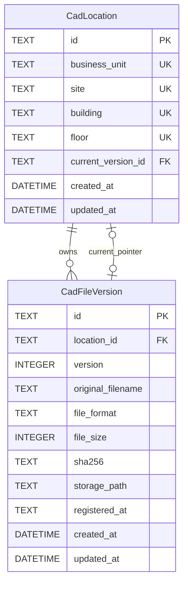

# Database Schema — 단일 기준 문서

상태: 2026-09-07 Unit 1 구현·검증. Prisma/Client/SQLite adapter 7.10.0, SQLite 파일 및 실제 Migration이 존재한다. 실제 정의는 src/prisma/schema.prisma와 202609070001_locations/migration.sql에 있으며 이 문서를 함께 갱신한다.

## 관계



그림의 네 위치 UK는 각각 Unique가 아니라 **네 Column 조합 Unique**이다. 소유 관계는 1:N, Current는 Location당 선택적 단일 참조이고 해당 Location이 소유한 Version만 가리킨다. 독립 `is_current` Column은 만들지 않고 API/UI에서 pointer 비교로 계산한다.

## CadLocation

| Column | SQLite / Prisma 타입 | Null | Default/생성 주체 | 제약·의미 |
| --- | --- | --- | --- | --- |
| id | TEXT / String | 불가 | Service UUID | PK; 문자열 위치 결합값 아님 |
| business_unit | TEXT / String | 불가 | 없음 | 정규화된 사업부, 1–100자 |
| site | TEXT / String | 불가 | 없음 | 사업장, 1–100자 |
| building | TEXT / String | 불가 | 없음 | 동, 1–100자 |
| floor | TEXT / String | 불가 | 없음 | 층, 1–100자 |
| current_version_id | TEXT / String? | 허용 | NULL | 아래 복합 FK; 최대 하나 Current |
| created_at | DATETIME / DateTime | 불가 | UTC now | 생성 시각, migration에서 CURRENT_TIMESTAMP 기본값 |
| updated_at | DATETIME / DateTime | 불가 | 생성 시 UTC now | Current 변경 등 update 시 Service가 UTC 갱신; DB가 자동 갱신한다고 가정하지 않음 |

Unique: `(business_unit, site, building, floor)` BINARY 비교. 저장 전 trim+NFC, 대소문자/내부 공백 유지. DB CHECK로 길이/빈 문자열/앞뒤 ASCII 공백을 제한하고 NFC는 Service와 import 경로에서 보장한다. 임의 SQL이 Unicode 정규화를 수행한다고 가정하지 않는다.

## CadFileVersion

| Column | SQLite / Prisma 타입 | Null | Default/생성 주체 | 제약·의미 |
| --- | --- | --- | --- | --- |
| id | TEXT / String | 불가 | Service UUID | PK |
| location_id | TEXT / String | 불가 | Service | FK→CadLocation.id |
| version | INTEGER / Int | 불가 | transaction 내 다음 정수 | CHECK > 0; Location별 1부터; UI는 V 접두어 |
| original_filename | TEXT / String | 불가 | Upload basename metadata | 1–255자; 경로로 사용 금지, 제어문자 거부 |
| file_format | TEXT / String | 불가 | 검증된 확장자 | CHECK IN ('DXF','DWG'); enum 사용 여부는 ORM 검증 후 |
| file_size | INTEGER / Int | 불가 | 실제 받은 bytes | CHECK > 0; 기본 상한은 앱 설정, Prisma Int 범위 내 설정만 허용 |
| sha256 | TEXT / String | 불가 | server streaming hash | 소문자 hex 64자 CHECK, Unique 아님 |
| storage_path | TEXT / String | 불가 | Storage key 생성 | Unique; 저장 루트 기준 상대 키, absolute path/client 경로 아님 |
| registered_at | TEXT / String | 불가 | 사용자 날짜, 기본 서울 오늘 | YYYY-MM-DD 달력 날짜; Service에서 실제 유효 날짜 검증 |
| created_at | DATETIME / DateTime | 불가 | UTC now | 생성 시각, migration CURRENT_TIMESTAMP 기본값 |
| updated_at | DATETIME / DateTime | 불가 | 생성 시 UTC now | update 경로에서 명시적으로 갱신 |

파일 bytes, location_id, version, storage_path는 등록 후 변경 불가인 서비스 계약이다. 파일 삭제/버전 이동/metadata 편집 API는 초기 범위에 없다. registered_at은 시각과 혼동하지 않도록 날짜 문자열로 유지한다.

## FK·Unique·Index

| 종류 / 이름(개념명 포함) | Column / 대상 | 목적 |
| --- | --- | --- |
| PK Location / Version | 각 id | 내부 식별자 |
| uq_location_key | Location(사업부,사업장,동,층) | 위치 중복 차단 |
| uq_location_current_owner | Location(id,current_version_id) | Prisma의 선택적 1:1 Current relation 표현 |
| uq_version_sequence | Version(location_id, version) | 동시 순번 중복 차단 |
| uq_version_owner_id | Version(location_id, id) | Current 복합 FK의 parent candidate key |
| uq_storage_path | Version(storage_path) | 파일 overwrite 방지 |
| fk_version_location | Version.location_id→Location.id | 존재하는 Location만 참조, DELETE/UPDATE NO ACTION |
| fk_location_current_owner | Location(id,current_version_id)→Version(location_id,id) | Current 소속 일치, DELETE/UPDATE NO ACTION |
| ix_location_current | Location(current_version_id) | pointer 역조회 |
| ix_version_registered | Version(registered_at DESC, created_at DESC, id) | 기본 목록 정렬 |
| ix_version_format_registered | Version(file_format, registered_at DESC) | 형식 filter |
| ix_version_sha256 | Version(sha256) | 중복 식별 |

위치별 Version 조회는 uq_version_sequence prefix를 활용한다. 임의 조합 위치 filter나 filename substring은 작은 SQLite P.O.C.의 scan을 허용하며 근거 없이 모든 column에 index를 추가하지 않는다.

Current FK 설계의 핵심 SQL 형태는 다음과 같다. **문서 예시이며 실행된 Migration이 아니다.**

```sql
-- CadFileVersion 제약
UNIQUE (location_id, version),
UNIQUE (location_id, id),
FOREIGN KEY (location_id) REFERENCES CadLocation(id)
  ON DELETE NO ACTION ON UPDATE NO ACTION

-- CadLocation 제약
UNIQUE (business_unit, site, building, floor),
FOREIGN KEY (id, current_version_id)
  REFERENCES CadFileVersion(location_id, id)
  ON DELETE NO ACTION ON UPDATE NO ACTION
```

`current_version_id`가 NULL이면 Current가 없는 상태를 허용한다. 값이 있으면 복합 FK가 자기 Location의 Version만 허용한다. 모든 DB connection에서 `PRAGMA foreign_keys=ON`을 확인해야 한다. 복합 FK는 parent key Unique가 필요하며 NULL을 포함하는 child key의 동작은 SQLite 공식 문서에 따른다. [SQLite Foreign Key Support](https://www.sqlite.org/foreignkeys.html)

## Transaction과 동시성

1. 신규 Location은 Current=NULL로 생성한다.
2. Version 생성 transaction에서 해당 Location의 MAX(version)+1을 계산하고 insert한다. Unique와 SQLite 쓰기 직렬화를 함께 사용하고 busy/충돌은 명시적 오류로 처리하고 commit 불확실 작업은 자동 재실행하지 않는다. transaction 밖에서 순번을 미리 확정하지 않는다.
3. `makeCurrent=true`이면 같은 transaction에서 Location.current_version_id를 새 Version ID로 바꾼다. false이면 pointer를 건드리지 않는다. 기존 Version flag를 별도로 update하지 않는다.
4. 기존 Version Current 변경은 Location/Version 존재·소속을 확인하고 단일 transaction으로 pointer와 updated_at을 갱신한다. 동일 ID 재요청은 멱등이다. 동시 유효 요청은 마지막 commit이 Current가 된다.
5. 예외 시 전체 rollback한다. FK는 API를 우회한 직접 SQL에서도 소속 위반을 거부해야 한다. 물리 파일과 DB의 실패 보상은 Architecture를 따른다.

Current 0개 허용, 다른 Location의 Current 독립, 잘못된 소속/존재하지 않는 Version/Current가 가리키는 Version 삭제 차단, 경쟁·rollback을 자동 시험한다.

## Migration 초기 계획 (당시 기록)

- Unit 0B에서 Prisma/SQLite driver 연결·정확한 버전·설정 로더를 검증하고 Unit 1에서 두 Table과 constraint를 구현한다.
- Prisma relation에서 소유 FK와 복합 Current FK의 겹치는 scalar 및 순환 relation을 검증한다. 선언만으로 불충분한 CHECK/복합 FK는 **검토 가능한 migration SQL**로 유지한다. Schema 대조 테스트로 누락을 방지한다.
- migration은 `src/prisma/migrations/`에 보관한다. 신규/기존 임시 DB 모두에 적용하고 `foreign_key_check`, table/index/FK introspection, 관련 DB 테스트로 Database.md와 대조한다.
- 기존 데이터를 변경할 때 사전 백업과 영향 분석을 한다. 운영에서는 검토된 migrate deploy 계열만 사용하고 reset/db push를 자동 실행하지 않는다. 실행 가능한 명령은 Unit 0B/1 완료 때 Operation에 확정한다.
- Prisma+SQLite에서 계획 제약을 표현/유지하지 못하면 실패 근거를 기록한다. ORM/DBMS 대체처럼 구조 영향이 큰 변경은 사용자와 확인한다.
- SQLite WAL/busy timeout은 driver 실제 지원과 concurrency 시험 후 설정하고 값을 문서화한다. 아직 활성화됐다고 보고하지 않는다.

## Schema 변경 이력

| 날짜 | 단계 | 변경 | Migration / 검증 |
| --- | --- | --- | --- |
| 2026-09-07 | 설계 초안 | Location/Version, 소속 검증 복합 Current FK, 순번/파일 식별/날짜 정의 | 없음 / 구현 전 |
| 2026-09-07 | 0.2.0 / Unit 1 | 두 모델·복합 Current FK·Unique/Index·위치/크기/형식/hash CHECK 구현 | 202609070001_locations / DB integration 6개 통과 |

실제 연결은 adapter의 FK 활성화를 PRAGMA 시험으로 확인했다. 쓰기는 단일 프로세스 queue로 직렬화하며 SQLite busy timeout 5초, transaction timeout 10초이다. commit 결과가 불확실한 작업을 자동 재실행하지 않는다. WAL은 아직 활성화하지 않았다. 운영 범위는 단일 Node 프로세스이다.

Unit 9A(2026-09-08): 실제 schema.prisma/migration의 두 Table, Column/Null/Default, 복합 FK 및 Unique/Index와 문서를 재대조했다. Schema 변경 없음. TC-DB-007 회귀 통과. 초기 계획의 retry 문구를 실제 단일 프로세스 queue/명시적 실패 정책과 일치시켰다.
